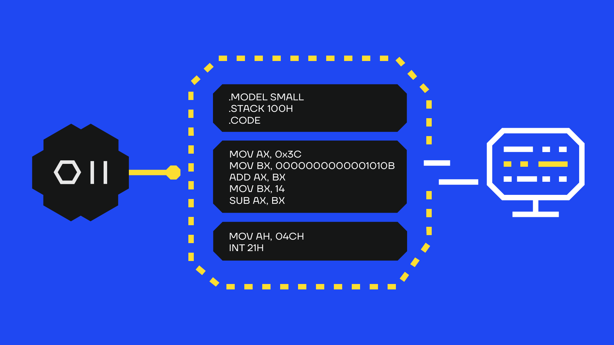

# SharpASM



SharpASM is a C# project that aims to automate ASM (i.e. shellcode) execution in .NET programs by exploiting code caves in RWX sections allocated by the CLR.

Read the blog post for the technical details: https://secforce.com/blog/sharpasm-sharpwhispers

# Requirements

- Visual Studio
- .NET Framework >= 3.5

# Usage

- Create Visual Studio .NET Framework project (follow the instructions [here](./examples/VisualStudioProject.md))
- Import SharpASM.cs file in the Visual Studio .NET Framework project.
- Include the namespace in the program
	```C#
	using SharpASM = SharpAssembly.SharpASM;
	```
- Define a byte array containing the shellcode
	```C#
	// __readgsqword(0x60)
    static byte[] bReadgsqword =
    {
        0x65, 0x48, 0x8B, 0x04, 0x25, 0x60,     // mov rax, qword ptr gs:[0x60]
        0x00, 0x00, 0x00,
        0xc3                                    // ret
    };
	```
- Call the shellcode using `SharpASM.callASM()`
	```C#
	var peb = SharpASM.callASM(bReadgsqword);
	```

# Example

A complete example to retrieve the PEB using assembly can be found [here](./examples/GetPEB.md).
